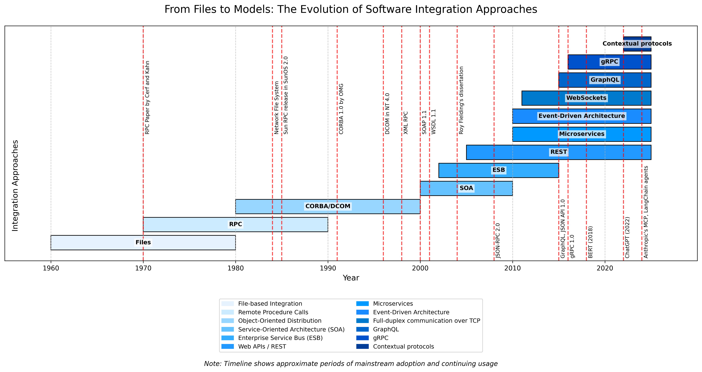

# Software Integration Timeline

A visualization tool for displaying the evolution of software integration approaches from 1960 to present day. This tool generates timeline diagrams showing the progression from file-based integration to modern approaches like microservices and context protocols.

The timeline may not be accurate and there might be some variations with real-world events. Please feel free to [contribute](CONTRIBUTING.md).



## Features

- Visualize the historical development of software integration approaches
- Highlight key milestones in software integration history
- Customizable timeline with color coding
- Export options for high-resolution images
- Data-driven approach allowing for updates and extensions

## Installation

```bash
# Clone the repository
git clone https://github.com/bvinothraj/software-timeline.git

# Navigate to the directory
cd software-timeline

# Install required packages
# On Mac
pip3 install -r requirements.txt

# On Windows
pip install -r requirements.txt

# Run
# On Mac
python3 src/timeline.py

# On Windows
python3 src/timeline.py

```

## License
[MIT License](LICENSE)


